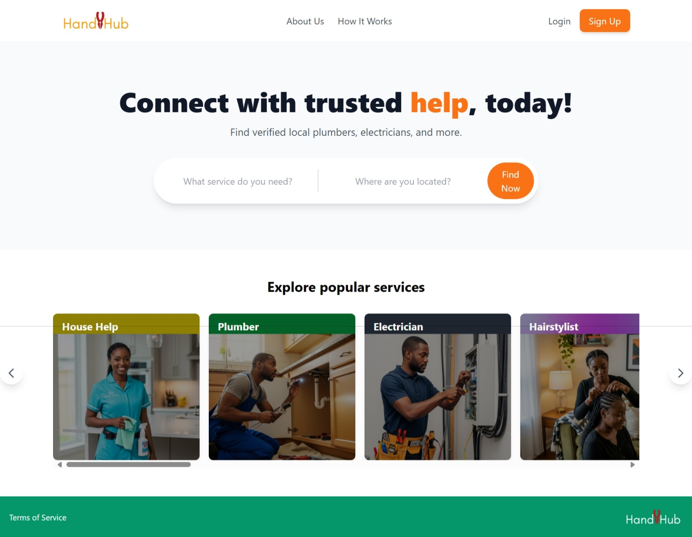

# HandyHub - Frontend Application ✨🎨

[](https://reactjs.org/)
[](https://vitejs.dev/)
[](https://tailwindcss.com/)
[](./LICENSE)
[](https://www.npmjs.com/)
[](https://github.com/your-username/HandyHub-frontend/issues)
[](https://github.com/gemgeek/HandyHub-frontend/actions)

---

## 📌 Project Overview  
This project is the **frontend** for my capstone project, **HandyHub**.  
It’s a web-based platform that connects users with verified local artisans and home service providers.  
The application is built with a modern tech stack to provide a **clean, intuitive, and user-friendly** experience.

---

## ✨ Key Features 
During the initial building phase, I focused on implementing the core pages and user flow.  
The following features have been successfully developed:

- **Homepage:** A welcoming landing page with a hero section, a functional search bar, and a list of popular services.  
- **Navigation:** A responsive navigation bar and a clean footer integrated across the entire application.  
- **Signup & Login Flow:** Full user authentication flow, including sign-up options for customers and artisans, plus a dedicated login page.  
- **Dashboard Layouts:** Separate, dynamic dashboard layouts for both customer and artisan user types.

---

## 🛠 Tech Stack
- ⚛️ **React:** JavaScript library for building user interfaces.  
- ⚡️ **Vite:** For building a fast and smooth dev experience.  
- 🎨 **Tailwind CSS:** For styling.  
- 🔗 **React Router:** For handling navigation and creating multiple pages.

---

## 📷 Screenshots 

*My Wireframe Design* 


*How it's going*


---

## 🚀 Future Plans
📱 **Responsive Design:** Implement mobile-friendly versions of all pages.

🔌 **API Integration:** Connect forms and dashboards to the backend API for real data and authentication.

🎯 **Styling & Polish:** Refine the overall styling to perfectly match wireframe designs.

⚠️ **Error Handling:** Implement robust error handling for user inputs and API responses.


---

## Final Project Status: All Core Features Complete ✨
This project is now a complete, full-stack application that is ready for its final submission. All the core features from my initial plan have been implemented and are working seamlessly.

### Final Achievements:
- Complete Authentication Flow: The sign-up and login pages are fully functional, securely communicating with the backend API.

- Dynamic Homepage: The homepage dynamically fetches and displays service categories from the backend. The cards are now perfectly sized and scrollable on both desktop and mobile.

- Responsive Design: The entire application, including the homepage, forms, and dashboards, is fully responsive and looks great on all screen sizes.

- Dynamic Dashboards: The customer and artisan dashboards load correctly and display data based on the user type, providing a personalized experience.

- Full Navigation: All pages are correctly linked, allowing for seamless navigation throughout the application.

### Screenshot



---
## Getting Started  
To run the HandyHub frontend locally:  

**1. Clone the repository:**  
```bash  
git clone https://github.com/your-username/HandyHub-frontend.git  
cd HandyHub-frontend  
```  

**2. Install dependencies:**  
```bash  
npm install  
```  

**3. Run the development server:**  
```bash  
npm run dev  
```  

The app will be available at:  
[http://localhost:5173](http://localhost:5173)  


[def]: /HandyHub-FE.jpeg